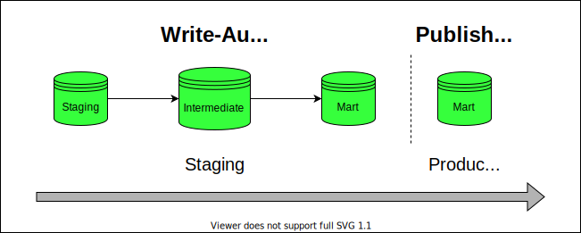
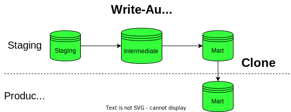

# axe-dbt-standards
dbt best practices and standards used in the AXE team at Hiflylabs.

**NOTE: This is a work in progress and only applicable for projects powered by Snowflake/BigQuery.**

# Table of Contents
1. [Onboarding](#onboarding)
    - [Greenfield](#greenfield)
    - [Brownfield](#brownfield)
2. [Dev Tools](#dev-tools)
3. [Branching](#branching)
4. [Pre-commit](#pre-commit)
    - [Installation](#installation)
    - [Configuration](#configuration)
    - [Initialization](#initialization)
5. [CI Pipeline](#ci-pipeline)
    - [Standard Approach](#standard-approach)
    - [ZCC CI](#zcc-ci)
6. [Troubleshooting](#troubleshooting)
    - [Store Test Failures](#store-test-failures)
    - [dbt-osmosis](#dbt-osmosis)
7. [Deployment](#deployment)
    - [Snowflake](#snowflake)
        - [Blue/green deployment](#bluegreen-deployment)
    - [BigQuery](#bigquery)
        - [WAP](#wap-write-audit-publish)
        - [WAC](#wac-write-audit-clone)
    - [Mirror layer](#mirror-layer)
8. [Testing](#testing)
9. [dbt Cloud](#dbt-cloud)
10. [Cost Monitoring](#cost-monitoring)


## Onboarding

### Greenfield

1. Make sure that you use a virtual environment to make it easier navigating between projects with different dependencies

```bash
python3 -m venv venv
source venv/bin/activate
```
> Make sure you add `venv` to `.gitignore` 

2. Install dbt dependencies

```bash
pip3 install dbt-core dbt-snowflake dbt-bigquery
```

Add `requirements.txt`

```bash
dbt-core==1.2.0
dbt-snowflake==1.2.0
dbt-bigquery==1.2.0
pre-commit==2.19.0
sqlfluff==1.2.0
sqlfluff-templater-dbt==1.2.0
dbt-osmosis
```

3. Initialize dbt project

```
dbt init <project_name>
```

### Brownfield

**Mach Speed: Copy-Edit-Paste**

> Prerequisities: Python >= 3.5

*In case the project is not brownfield and you have already a repo and dependency*

Mac/Linux

```bash
git clone https://github.com/<org>/<repo>.git
cd <repo>
python3 -m venv venv
source venv/bin/activate
python3 -m pip install --upgrade pip
python3 -m pip install -r requirements.txt
source venv/bin/activate
dbt build
dbt docs generate
dbt docs serve
```

Windows

```bash
git clone https://github.com/<org>/<repo>.git
cd <repo>
python -m venv venv
venv\Scripts\Activate.ps1
python -m pip install --upgrade pip
python -m pip install -r requirements.txt
venv\Scripts\Activate.ps1
dbt build
dbt docs generate
dbt docs serve
```

3. store credentials and secrets in the environment by adding the following to your `./venv/bin/activate` file

### Snowflake:

```bash
export SNOWFLAKE_USER=<your_snowflake_user>
export SNOWFLAKE_PASSWORD=<your_snowflake_password>
export SNOWFLAKE_ACCOUNT=<your_snowflake_account>
```
### BigQuery:

```bash
export BIGQUERY_PROJECT=<your_bigquery_project_id>
```

4. Setup your profile and project file

### Snowflake

For more, consult the [dbt docs](https://docs.getdbt.com/reference/warehouse-profiles/snowflake-profile)

```yaml
sf_project_name:
  outputs:
    dev:
      account: "{{ env_var('SNOWFLAKE_ACCOUNT') }}"
      database: analytics_dev
      password: "{{ env_var('SNOWFLAKE_PASSWORD') }}"
      query_tag: dbt
      role: TRANSFORMER
      schema: <your personal schema name>
      threads: 4
      type: snowflake
      user: "{{ env_var('SNOWFLAKE_USER') }}"
      warehouse: TRANSFORMING
  target: dev
```

### BigQuery

For more consult the [dbt docs](https://docs.getdbt.com/reference/warehouse-profiles/bigquery-profile)

```yaml
bq_project_name:
  outputs:
    dev:
      dataset: <your developer dataset>
      location: <your dataset location>
      method: oauth
      priority: interactive
      project: "{{ env_var('SNOWFLAKE_PASSWORD') }}"
      retries: 1
      threads: 4
      timeout_seconds: 300
      type: bigquery
  target: dev
```

5. Check your connections

```bash
dbt debug
```
## Dev Tools

### VSCode plugins

Make sure you check in the util readme if you need to configure IDE settings to make them work!

- [vscode-dbt](https://marketplace.visualstudio.com/items?itemName=analyst-snowflake.vscode-dbt)
- [dbt Power User](https://marketplace.visualstudio.com/items?itemName=analyst-collective.dbt-power-user)
- [dbt-osmosis](https://github.com/z3z1ma/dbt-osmosis)
- [CSV Viewer tool](https://marketplace.visualstudio.com/items?itemName=mechatroner.rainbow-csv)
- [GitLens](https://marketplace.visualstudio.com/items?itemName=eamodio.gitlens)

## Branching

For branching we use the [git flow](https://nvie.com/posts/a-successful-git-branching-model/) branching model. This means that we have two main branches: `master` and `develop`. The `master` branch is used for production deployments and the `develop` branch is used for staging deployments. For each feature, we create a new branch from `develop` and merge it back into `develop` once it's ready to be deployed to staging. Once we are ready to deploy to production, we merge `develop` into `master`.

For a further staging layer, please consult [this](https://docs.getdbt.com/blog/the-case-against-git-cherry-picking) blogpost.

## Pre-commit

### Installation

```bash
pip3 install pre-commit
```

We are mainly using the following three repos:
- [Pre-commit hooks](https://github.com/pre-commit/pre-commit-hooks)
- [SQLFluff](https://docs.sqlfluff.com/en/stable/production.html)
- [pre-commmit-dbt](https://github.com/offbi/pre-commit-dbt)


### Configuration

Add to `.pre-commit-config.yaml`

```yaml
repos:
- repo: https://github.com/offbi/pre-commit-dbt
  rev: v1.0.0
  hooks:
  - id: check-script-semicolon
  - id: check-script-has-no-table-name
  - id: dbt-test
  - id: dbt-docs-generate
  - id: check-model-has-all-columns
    name: Check columns - core
    files: ^models/core
  - id: check-model-has-all-columns
    name: Check columns - mart
    files: ^models/mart
  - id: check-model-columns-have-desc
    files: ^models/mart
- repo: https://github.com/pre-commit/pre-commit-hooks
  rev: v4.0.1
  hooks:
    - id: trailing-whitespace
    - id: end-of-file-fixer
    - id: check-yaml
- repo: https://github.com/sqlfluff/sqlfluff
  rev: 1.2.0
  hooks:
    - id: sqlfluff-lint
      files: 'models/'
      additional_dependencies: ['dbt-snowflake==1.2.0', 'sqlfluff-templater-dbt']
    - id: sqlfluff-fix
      files: 'models/'
      additional_dependencies: ['dbt-snowflake==1.2.0', 'sqlfluff-templater-dbt']
```
### Initialization

```bash
pre-commit install
```

## CI Pipeline

### Standard Approach

To setup a the Github integration, you have to have an admin account on the Github repository. This is because you need to add a webhook to the repository. This webhook will trigger the CI pipeline when a new commit is pushed to the repository.

Find the official documentation [here](https://docs.getdbt.com/docs/dbt-cloud/using-dbt-cloud/cloud-enabling-continuous-integration)

### ZCC CI

The zero-copy-clone CI creates a mirror environment of the target database and builds the models in that environment, ensuring that all tables are available in the environment.

Original idea from [here](https://medium.com/airtribe/test-sql-pipelines-against-production-clones-using-dbt-and-snowflake-2f8293722dd4)

```sql


    {{ log("Cloning database " ~ db ~ " to " ~ clone_db, info=True) }}

    {{ log("The following schemas will be cloned: " ~ schemas_to_clone, info=True)}}

    

        DROP DATABASE IF EXISTS {{clone_db}};
        CREATE DATABASE {{clone_db}};
        
            
                
                create schema {{target.schema}}_{{custom}} clone {{db}}.{{schema_name}};
            
                create schema {{target.schema}} clone {{db}}.{{schema_name}};
            
        
        GRANT ALL ON DATABASE {{clone_db}} TO ROLE {{role}};

        {# grant access for debugging #}
        GRANT USAGE ON DATABASE {{clone_db}} TO ROLE TRANSFORMER;

    

    {{ log("Database cloning completed!", info=True) }}





    

        {# If it is a PR from the feature bracnh against development, then clone the ANALYTICS_DEV #}
         {{ clone_prod_update_permissions(var('dev_db'), var('development_clone_db'), var('clone_role'), var('schemas_to_clone')) }}

    

        {# If it is a PR from the development against main, then clone the ANALYTICS_PROD #}
        {{ clone_prod_update_permissions(var('prod_db'), var('production_clone_db'), var('clone_role'), var('schemas_to_clone')) }}

    

        {{ log(target.name ~" is not meant to be used for PR testing", info=True) }}

    
  

```

Add these to your `dbt_project.yml` file

```yaml
vars:
# Databases
  "dev_db" : "ANALYTICS_DEV"
  "prod_db" : "ANALYTICS_PROD"
  "production_clone_db" : "ANALYTICS_PROD_CLONE"
  "development_clone_db" : "ANALYTICS_DEV_CLONE"
  # Roles
  "clone_role" : "SYSADMIN"
  # Schemas to clone
  "schemas_to_clone" : ["ANALYTICS", "ANALYTICS_STAGING", "ANALYTICS_SEED", "ANALYTICS_RAW_SAMPLE"]
```

>N.B. Note that this can cause discrepancies if you run multiple PR as they can overwrite each other. This is why we recommend to test PRs one by one with this solution. The future implementation would create custom clone databases for each PR.

## Troubleshooting

### Store Test Failures

We are able to write test failures and warnings directly into our datawarehouse. It helps in identifying records responisble for the anomaly.

Add to `dbt_project.yml`

Optional schema parameter will store audit tables in `target.schema_audit` schema

```yaml
tests:
  +store_failures: true
  +schema: 'audit'
```

todo: gif here

For more check out the official [documentation](https://docs.getdbt.com/reference/resource-configs/store_failures)

### dbt-osmosis

This is a must have to preview model excerpts and test out blocks of a complex logic causing a test to fail or wrong data in the output.

Repo [here](https://github.com/z3z1ma/dbt-osmosis)

todo: gif here

## Deployment

Our goal is to keep an isolated environment for testing out new features before pushing it to production.

This is called as blue-green deployment. See more [here](https://discourse.getdbt.com/t/performing-a-blue-green-deploy-of-your-dbt-project-on-snowflake/1349/8).

### Snowflake
#### Blue/green deployment

https://blog.montrealanalytics.com/blue-green-deployment-with-dbt-and-snowflake-922f1c658011

### BigQuery

Unfortunately, swapping is only available in Snowflake, so the idea is to run & test all models before loading it to the production environment instead.

This is called WAP (Write-Audit-Publish). Read more about this [here](https://calogica.com/assets/wap_dbt_bigquery.pdf).

BigQuery is not able to able to rename datasets, therefore, swapping by renaming with subsequent commits is ruled out.

#### WAP (Write-Audit-Publish)

This is a classical approach mentioned by the deck linked above.

1. Builds all in an audit staging dataset
2. Then, build only top level models under the activation (BI) layer in prod again.
3. Traffic is stopped if the build failed in the audit environment.

<p align="center">

</p>


Here's the macro to implement it:

```sql




    
        
        unaudited
        
        {{ custom_schema_name | trim }}
        
    
        {{ default_schema }}
    




    {{ generate_schema_name_for_env(schema_name) }}
{%- endmacro %
```

Add tags to mart (top) layer (or separate folder structure)

```yaml
models:
  mart:
    +tags: ['mart']
```

**dbt Cloud job**

```bash
#build it in an audit dataset
dbt run --target prod_audit
dbt test --target prod_audit

#recreate top-layer in production with tags
dbt run --target prod -s tag:mart
#or with path
dbt run --target prod -s mart.*
```

#### WAC (Write-Audit-Clone)

One thing which helps us move forward is that BigQuery also has now a Table Clone feature.

What we can do is to use the production job to load to the data to a new dataset e.g. `analytics_stage` and clone the top-level tables with the `mart` tag to `analytics_prod`.

<p align="center">

</p>

>Please do review the code below before copy-pasting as it can be specific to a use-case!

```


    --check if the two sets have intersection
    
        
           {{ return(True) }}
        
    
    {{ return(False) }}
    




{#
    EXPECTED BEHAVIOR:
      1. Loads every table to a single dataset (this requires using a different target name than 'prod')
      2. Gatheres all the model/table names maching with the supplied tags
      3. We redistribute the tables to the correct datasets in production depending on the tag (=dataset)

#}



    {{ dbt_utils.log_info("Gathering tables to clone from...") }}

    

    

    -- create empty dictionary for table-tag mapping
    

        -- clone only intersectrions and tables
        

            

                  

            

            

        

    

    {{ dbt_utils.log_info("Cloning in progress...") }}

    -- iterate through all the tables and clone them over to chosen destination
    

        -- create prod schema if not exists
        
            create schema if not exists {{ key }};
        
        
        

        
        
            

                -- copy from single analytics_staging schema but distribute to different schemas in prod
                create or replace table
                {{ target.project }}.{{ key }}.{{ item }}
                clone {{ target.project }}.{{ target.dataset }}.{{ item }};

            
        
        

        {{ dbt_utils.log_info("Tables cloned successfully!") }}

    



{{ dbt_utils.log_info("WAP is only supported on staging! Process skipped...") }}




```

**Then in dbt Cloud, the process would be:**

1. builds all in the staging (pre-prod) dataset
2. copies all tables over to prod with the macro

```
#build it in analytics_staging
dbt seed
dbt run
dbt test

#copy mart layer to analytics
dbt run-operation write_audit_publish
```

**Limitations:**

- We can’t copy views — no problem because we don’t have those
- Additional storage cost incurred on the difference between clones and source tables

### Mirror Layer

Time and time again, we stumble into data integration issues because we are still dependent on third-party data submissions. Put simply, if source shares/servers are not live, we are not able to run our end-to-end jobs or certain tables are empty.

Another way to overcome that is instead of creating is that we create a layer at the bottom just before staging.

Structurally, the project would be extended with a `raw` layer which copies the source tables 1:1:

```sql
with source as (

    select * from {{ source('name', 'table') }}

),
```

This layer then would be separated from the dev/production main build job and refreshed manually when needed.

**dbt Cloud job:**

```bash
#build it from staging
dbt build staging.*+
```

## Testing
## dbt Cloud
## Cost Monitoring
