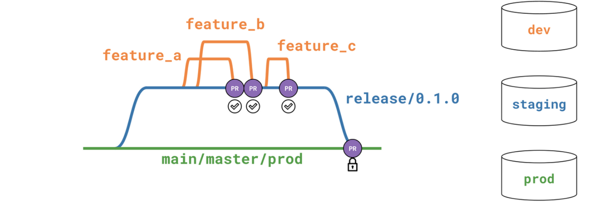

# 🎋 Branching

For branching we use the [git flow](https://nvie.com/posts/a-successful-git-branching-model/) branching model. 

- **main**: reflects the production state of the project.
- **dev/staging**: includes the features contained before a release (= merge to the main production branch).
- **feature/name**: holding atomic changes to the project and to be merged into the development branch via separate peer-reviewed PRs.

<p align="center">

</p>


## 👩‍⚖️ Main rules:

- Each feature branch/PR should represent one logical piece of work
- Make sure commits are related to the pull request and look clean
- Always perform pull before commit and push
- Do a git pull before you start working
- Regularly synchronize your local repos to the remote one
- Always create branches from the `dev` branch
- Try to minimize the time between creating a new branch and opening a PR
- By convention, name branches as feature/<branch_name> or fix/<branch_name>
- Small independent fixes or bulk tests/docs can go into one branch

Submitting a PR:
Feature PRs must be submitted to the development branch, and new releases occur when a PR is submitted from development to main. Every PR submission should follow the same template guidelines automatically provided when opening a PR.

### It should consist

- a short description around the purpose of the request,
- the assigned JIRA ticket (if applicable),
- the changes made in bullet points,
- affected/introduced models

## Merging

PRs should be reviewed by other developers and (or) project maintainers, preferably having enough information on what's the issue it solves, or what feature we are planning to implement with the underlying change. Also implemented changes should be frequently checked with business requirements to make sure that it brings the desired change.

PRs all-around the project should be the core responsibility of the project maintainer. Someone who oversees the business logic and can prioritize between developer tickets created for the sprint. Feature developers must ensure that the source branch does not have any conflict with the target branch. Upon merging a feature to development, the feature branch should be purged from the remote repository.

### 🌡️ Hotfixes:

Hotfixes to the main branch can be developed and integrated in one of the two following ways:

As a standard modification via the development branch. Since deploys are planned to be fairly frequent, many hotfixes may wait until the next scheduled release (in many cases a few days or less).

If the hotfix is very urgent, the following steps are required:
1. Branch the hotfix off the main branch. Hotfix branch name should be prefixed with hotfix/.
2. Make the changes and test them in your own dev environment.
3. Create a PR.
4. When the PR is submitted, the CI job will be triggered. Let it run. Make note of the errors it may create.
5. Have somebody else to merge the PR. In these pressing situations it is even more important to have your work reviewed.
6. Coordinate with business users on the most appropriate time to make the new/fixed data available.
7. At such time, upon the successful PR test and merge, run the daily job..

[PR Template](../templates/pull_request_template.md)):

Copy this below into `.github/pull_request_template.md`:

```markdown

```markdown
<!---
Provide a short summary in the Title above. Examples of good PR titles:
* "Feature: add so-and-so models"
* "Fix: deduplicate such-and-such"
* "Update: dbt version 0.13.0"
-->

## Description & motivation
<!---
Describe your changes, and why you're making them. Is this linked to an open
issue, a Jira card, or another pull request? Link it here.
-->

## To-do before merge
<!---
(Optional -- remove this section if not needed)
Include any notes about things that need to happen before this PR is merged, e.g.:
- [ ] Change the base branch
- [ ] Update dbt Cloud jobs
- [ ] Ensure PR #56 is merged
-->

## Screenshots:
<!---
Include a screenshot of the relevant section of the updated DAG. You can access
your version of the DAG by running `dbt docs generate && dbt docs serve`.
-->

## Validation of models:
<!---
Include any output that confirms that the models do what is expected. This might
be a link to an in-development dashboard in your BI tool, or a query that
compares an existing model with a new one.
-->

## Changes to existing models:
<!---
Include this section if you are changing any existing models. Link any related
pull requests on your BI tool, or instructions for merge (e.g. whether old
models should be dropped after merge, or whether a full-refresh run is required)
-->

## Checklist:
<!---
This checklist is mostly useful as a reminder of small things that can easily be
forgotten – it is meant as a helpful tool rather than hoops to jump through.
Put an `x` in all the items that apply, make notes next to any that haven't been
addressed, and remove any items that are not relevant to this PR.
-->
- [ ] My pull request represents one logical piece of work.
- [ ] My commits are related to the pull request and look clean.
- [ ] My SQL follows the [dbt Labs style guide](https://github.com/dbt-labs/corp/blob/master/dbt_style_guide.md).
- [ ] I have materialized my models appropriately.
- [ ] I have added appropriate tests and documentation to any new models.
- [ ] I ran the sqlfluff linter in my development environment without error.
- [ ] My dbt package has no residual models that are no longer used.
- [ ] I have updated the README file.
```


