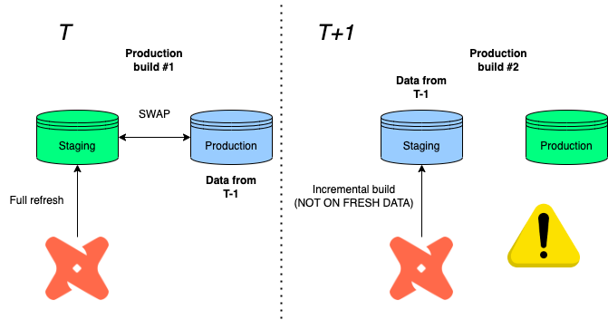
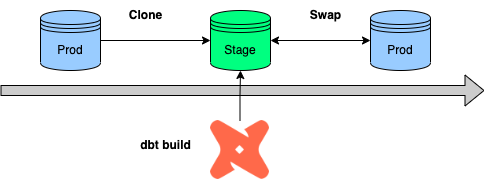
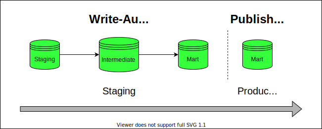
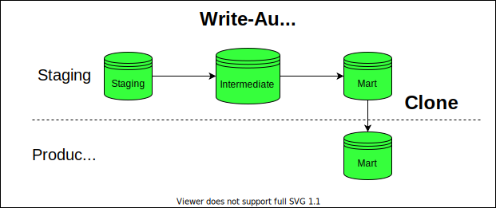
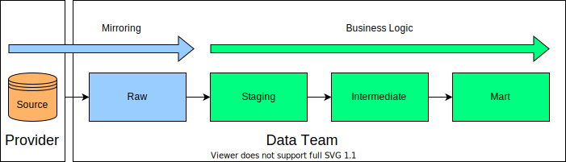

# 🛳️ Deployment

Our goal is to keep an isolated environment for testing out new features before pushing it to production.

This is called as blue-green deployment. See more [here](https://discourse.getdbt.com/t/performing-a-blue-green-deploy-of-your-dbt-project-on-snowflake/1349/8).

### ❄️ Snowflake
#### 🟦🟩 Blue/green deployment

**References:**
- [Standard implementation](https://discourse.getdbt.com/t/performing-a-blue-green-deploy-of-your-dbt-project-on-snowflake/1349/8)
- [In more detail](https://blog.montrealanalytics.com/blue-green-deployment-with-dbt-and-snowflake-922f1c658011)

> ⚠️ Warning! If you want to keep using incremental build, go with production rollback 👇 instead!

As former productiontables get demoted to stagingvia the swap feature, the next incremental load will build on top of obsolete tables in staging before swapping.

Imagine:

- T: Imagine that our run fully refreshes the data in staging, then swaps it with the production database in T-1
- T+1: A new production cycle is due, but only certain data sources have to be processed again, so you decide to go with an incremental refresh.
- T+1: You then wonder why all the information we updated in T is missing?

<p align="center">

</p>


Well, since we built on top of a production data in T-1 before swapping again, the information loss is the difference between staging and production in T!

#### 🧻 Production rollback

Instead of swapping databases, (1) we copy the previous production data to a staging environment, (2) rebuild the tables under scope, then (3) clone it back to production.

This also works with incremental models, because we always clone back the latest production loading before building on top of it.

<p align="center">

</p>

### 🔍 BigQuery

Unfortunately, swapping is only available in Snowflake, so the idea is to run & test all models before loading it to the production environment instead.

This is called WAP (Write-Audit-Publish). Read more about this [here](https://calogica.com/assets/wap_dbt_bigquery.pdf).

BigQuery is not able to able to rename datasets, therefore, swapping by renaming with subsequent commits is ruled out.

#### WAP (Write-Audit-Publish)

This is a classical approach mentioned by the deck linked above.

1. Builds all in an audit staging dataset
2. Then, build only top level models under the activation (BI) layer in prod again.
3. Traffic is stopped if the build failed in the audit environment.

<p align="center">

</p>


Here's the macro to implement it:

```sql




    
        
        unaudited
        
        {{ custom_schema_name | trim }}
        
    
        {{ default_schema }}
    




    {{ generate_schema_name_for_env(schema_name) }}
{%- endmacro %
```

Add tags to mart (top) layer (or separate folder structure)

```yaml
models:
  mart:
    +tags: ['mart']
```

**dbt Cloud job**

```bash
#build it in an audit dataset
dbt run --target prod_audit
dbt test --target prod_audit

#recreate top-layer in production with tags
dbt run --target prod -s tag:mart
#or with path
dbt run --target prod -s mart.*
```

#### WAC (Write-Audit-Clone)

One thing which helps us move forward is that BigQuery also has now a Table Clone feature.

What we can do is to use the production job to load to the data to a new dataset e.g. `analytics_stage` and clone the top-level tables with the `mart` tag to `analytics_prod`.

<p align="center">

</p>

>Please do review the code below before copy-pasting as it can be specific to a use-case!

```sql


    --check if the two sets have intersection
    
        
           {{ return(True) }}
        
    
    {{ return(False) }}
    




{#
    EXPECTED BEHAVIOR:
      1. Loads every table to a single dataset (this requires using a different target name than 'prod')
      2. Gatheres all the model/table names maching with the supplied tags
      3. We redistribute the tables to the correct datasets in production depending on the tag (=dataset)

#}



    {{ dbt_utils.log_info("Gathering tables to clone from...") }}

    

    

    -- create empty dictionary for table-tag mapping
    

        -- clone only intersectrions and tables
        

            

                  

            

            

        

    

    {{ dbt_utils.log_info("Cloning in progress...") }}

    -- iterate through all the tables and clone them over to chosen destination
    

        -- create prod schema if not exists
        
            create schema if not exists {{ key }};
        
        
        

        
        
            

                -- copy from single analytics_staging schema but distribute to different schemas in prod
                create or replace table
                {{ target.project }}.{{ key }}.{{ item }}
                clone {{ target.project }}.{{ target.dataset }}.{{ item }};

            
        
        

        {{ dbt_utils.log_info("Tables cloned successfully!") }}

    



{{ dbt_utils.log_info("WAP is only supported on staging! Process skipped...") }}




```

Cloned tags are driven by the `tags_to_clone` variable:

```yaml
vars:
  tags_to_clone: ['mart', 'utils']
```

**Then in dbt Cloud, the process would be:**

1. builds all in the staging (pre-prod) dataset
2. copies all tables over to prod with the macro

```bash
#build it in analytics_staging
dbt seed
dbt run
dbt test

#copy mart layer to analytics
dbt run-operation write_audit_publish
```

**Limitations:**

- We can’t copy views — no problem because we don’t have those
- Additional storage cost incurred on the difference between clones and source tables

### 🪞 Mirror Layer

Time and time again, we stumble into data integration issues because we are still dependent on third-party data submissions. Put simply, if source shares/servers are not live, we are not able to run our end-to-end jobs or certain tables are empty.

Another way to overcome that is instead of creating is that we create a layer at the bottom just before staging.

Structurally, the project would be extended with a `raw` layer which copies the source tables 1:1:

<p align="center">

</p>

```sql
with source as (

    select * from {{ source('name', 'table') }}

),
```

This layer then would be separated from the dev/production main build job and refreshed manually when needed.

**dbt Cloud job:**

```bash
#build it from staging
dbt build staging.*+
```