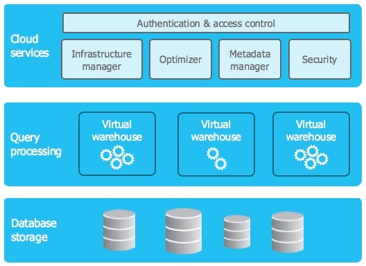

## 🏗️ Architecture Overview

Snowflake’s architecture separates the following core components:

- **Storage**:
    Scalable, fully-managed object storage layer. All your data (tables, staged files, etc.) lives here. Storage costs depend on data volume and retention features (time tavel, fail-safe).
    
- **Compute (Virtual Warehouses)**:
    On-demand compute clusters that execute your queries. You control their size, concurrency and auto-suspend settings. Compute is the biggest cost driver in typical workflows.
    
- **Cloud Services**:
    Manages metadata, authentication and access control. Usually free unless it exceeds 10% of your compute usage.
    
- **Serverless Compute**:
    Optional, Snowflake-managed compute for specific features like:
    - Search Optimization Service (SOS)
    - Query Acceleration Service (QAS)
    - Tasks and Dynamic Tables
    - ...and other serverless features

**Key concept**:
*Storage and compute scale independently. You only pay for the compute resources (credits) you actually use, while storage is billed separately.*

**More info**: [Key Concepts & Architecture](https://docs.snowflake.com/en/user-guide/intro-key-concepts)