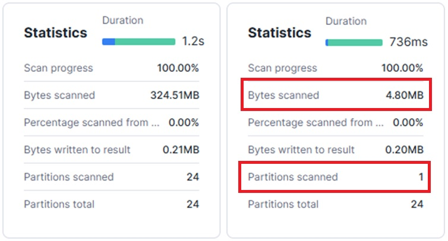

## 🗂️ Clustering and Micro-partitions

This section explains how clustering works in Snowflake, when to use it and how to apply it effectively to improve query performance while managing costs.

### [Micro-partitions:](https://select.dev/posts/snowflake-micro-partitions)
- The fundamental **unit of storage** in Snowflake
- Typically between **50 and 500 megabytes**, compressed and stored in a **columnar format**
- Each micro-partition includes **metadata indexing**, which helps optimize data scanning
- Micro-partitions are **automatically created and managed** when data is loaded into tables

### [Clustering explained:](https://select.dev/posts/snowflake-clustering)
By default, data is distributed into micro-partitions based on **load order**.
This can lead to **misaligned partitions** that don’t match common query filters, causing unnecessary partitions to be scanned.

**Clustering** improves this by organizing data at the metadata level so that queries can **skip irrelevant partitions**, reducing scan volume and improving performance.

### 📝 When/how to use clustering:
- Snowflake recommends using clustering **only for large tables** (multi-terabyte scale)
- Start with **1–2 large tables**
- Monitor credit usage **before applying widely**
- Choose **3–4 clustering keys maximum**
- The exact keys and method depend entirely on your query patterns

💡 **Example of good keys:** Dates, categories, status columns

🚫 **Avoid:** Unique IDs, free-text fields

🛠️ [`cluster_by`](https://docs.getdbt.com/reference/resource-configs/snowflake-configs#configuring-table-clustering) in dbt

### 🔎 Automatic Clustering:
- **Fully serverless** → Snowflake manages when and how reclustering happens
- **No user control** over scheduling or frequency — Reclustering may occur at any time of day
- **No upfront cost estimate** — Costs depend on data volume, change frequency and can only be monitored after enabling
- `SNOWFLAKE.ACCOUNT_USAGE.AUTOMATIC_CLUSTERING_HISTORY` - Monitor automatic clustering activity

### 📊 Example
