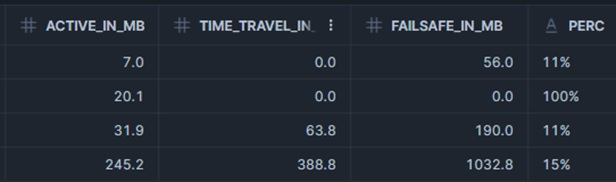

## 🛡️ Storage-related features

*Snowflake’s continuous data protection feature set:*

[**Time Travel**](https://docs.snowflake.com/en/user-guide/data-time-travel)
- Available for permanent and transient tables
- Can be accessed and queried manually by the users
- Available for a maximum of 90 days* under an Enterprise license
    - Only up to 1 day for transient tables

[**Fail-Safe**](https://docs.snowflake.com/en/user-guide/data-failsafe)
- Managed by Snowflake
- Only available for permanent tables
- Intended as a last resort
- Recovered through support ticket
- Non-configurable 7-day period

**Note:**
While both provide powerful data protection, they can significantly increase storage costs depending on data change patterns. [Frequent updates or deletes can multiply storage usage](https://docs.snowflake.com/en/user-guide/data-cdp-storage-costs#storage-usage-and-fees) and it's recommended to monitor storage consumption regularly, especially for large and frequently changing tables.

**Monitoring:** `SNOWFLAKE.ACCOUNT_USAGE.TABLE_STORAGE_METRICS`
