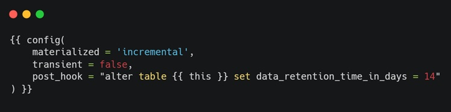

## 🗄️ Table types

Snowflake supports [various table types](https://docs.snowflake.com/en/guides-overview-db). dbt typically uses `TRANSIENT` tables by default.

| Table Type | Data Protection & Retention (CDP) | Storage & Lifetime | Recommended Usage |
|------------|-----------------------------------|--------------------|--------------------|
| Permanent Table | ✅ Fail-safe + Time Travel (up to 90 days) | Standard storage  + Fail-safe cost | Critical, hard-to-reproduce datasets; Key incremental models |
| Transient Table (*default in dbt*) | ✅ Only Time Travel (up to 1 day) ❌ No Fail-safe | Standard storage only (no Fail-safe cost) | Most dbt models |

**The full-refresh materialization recreates tables after each dbt run:**
- No need to apply data retention features
- Snowflake does not retain historical data for these tables outside of Time Travel
- Can result in a measurable reduction of storage costs

**Configuring transient table type:**
[dbt docs](https://docs.getdbt.com/reference/resource-configs/snowflake-configs#configuring-transient-tables-in-dbt_projectyml)

**Note:** Turning models to permanent tables is only logically reasonable for incremental models, and only after validating the business need for extended data recovery

💡 *Extended Time Travel*: Use post-hooks to extend the default Time Travel period
